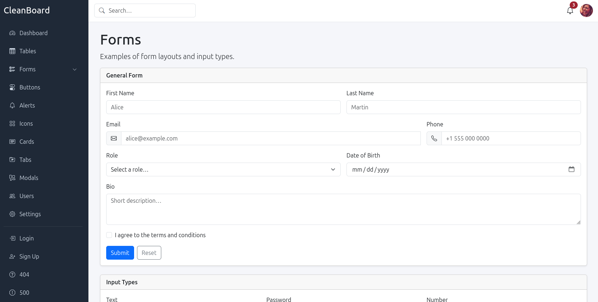

# CleanBoard

[](LICENSE)
[]()

A clean, modern admin dashboard HTML template built with Bootstrap 5. No build tools, no npm, no dependencies — just open a file and go.

## Preview



## Features

- **Responsive layout** — mobile-friendly sidebar that collapses below 991px
- **WCAG 2.1 Level AA** — accessible markup, correct color contrast, ARIA attributes throughout
- **Dashboard & stat widgets** — key metrics with icon highlights
- **Notification system** — interactive dropdown with unread badge
- **User profile menu** — dropdown with avatar and user actions
- **Component library** — forms, tables, cards, tabs, modals, alerts, buttons, icons
- **Auth pages** — pre-built login and sign-up screens
- **Error pages** — styled 404 and 500 error pages
- **Zero dependencies** — Bootstrap and Icons loaded from CDN; no npm, no build step

## Pages

| File | Description |
|------|-------------|
| `index.html` | Main dashboard with stat widgets and notifications |
| `login.html` | Login page with social auth options |
| `signup.html` | User registration form |
| `tables.html` | Data table examples |
| `forms.html` | Inputs, checkboxes, radios, floating labels |
| `cards.html` | Stat cards, profile cards, pricing cards |
| `tabs.html` | Tab navigation components |
| `modals.html` | Modal dialog examples |
| `alerts.html` | Alert and notification components |
| `buttons.html` | Button styles and variants |
| `icons.html` | Bootstrap Icons showcase |
| `404.html` | 404 not found error page |
| `500.html` | 500 internal server error page |

## Tech Stack

- **Bootstrap 5.3.3** — responsive grid and UI components (CDN)
- **Bootstrap Icons 1.11.3** — icon library (CDN)
- **Vanilla JavaScript** — sidebar toggle and page interactions, no framework

## Getting Started

No installation required.

```bash
git clone https://github.com/tuxonice/clean-board.git
cd clean-board
```

Open `src/index.html` directly in your browser, or serve it locally:

```bash
python3 -m http.server 8080 --directory src
# → http://localhost:8080
```

## Project Structure

```
clean-board/
├── src/
│   ├── index.html      # Main dashboard
│   ├── login.html      # Login page
│   ├── signup.html     # Sign up page
│   ├── tables.html     # Data tables
│   ├── forms.html      # Form components
│   ├── cards.html      # Card layouts
│   ├── tabs.html       # Tab navigation
│   ├── modals.html     # Modal dialogs
│   ├── alerts.html     # Alert components
│   ├── buttons.html    # Button variants
│   ├── icons.html      # Icons showcase
│   ├── 404.html        # 404 error page
│   ├── 500.html        # 500 error page
│   ├── style.css       # Shared styles
│   └── app.js          # Shared scripts
└── README.md
```

## Customization

### Colors

CSS variables are defined at the top of each page's `<style>` block:

```css
:root {
    --sidebar-bg: #1f2937;
    --page-bg: #f5f6fa;
}
```

### Branding

Update the brand name in the sidebar of each page:

```html
<h4 class="mb-4">CleanBoard</h4>
```

### Adding Pages

Copy any existing page, update the `<title>` tag, set the correct `active` class on the sidebar nav link, and add your content inside `<main>`.

## Accessibility

CleanBoard targets **WCAG 2.1 Level AA** compliance:

- All icons use `aria-hidden="true"` inside labeled elements
- All `<nav>` elements have descriptive `aria-label` attributes
- Color contrast meets the 4.5:1 minimum ratio
- Interactive elements have accessible names
- A skip-to-content link is included on each page

## Browser Support

Chrome, Firefox, Safari, and Edge (latest versions).

## Contributing

Bug reports and suggestions are welcome — open an issue or submit a pull request.

## License

MIT — see [LICENSE](LICENSE) for details.

## Credits

- [Bootstrap](https://getbootstrap.com/) — CSS framework
- [Bootstrap Icons](https://icons.getbootstrap.com/) — icon library
- [Pravatar](https://pravatar.cc/) — placeholder avatar images
